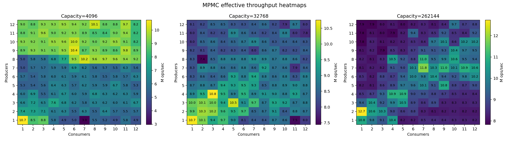
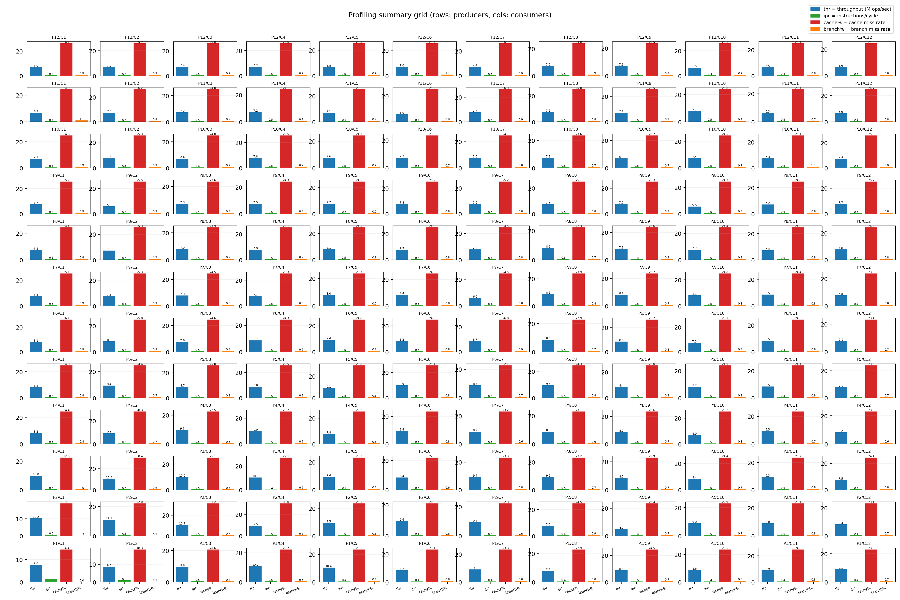
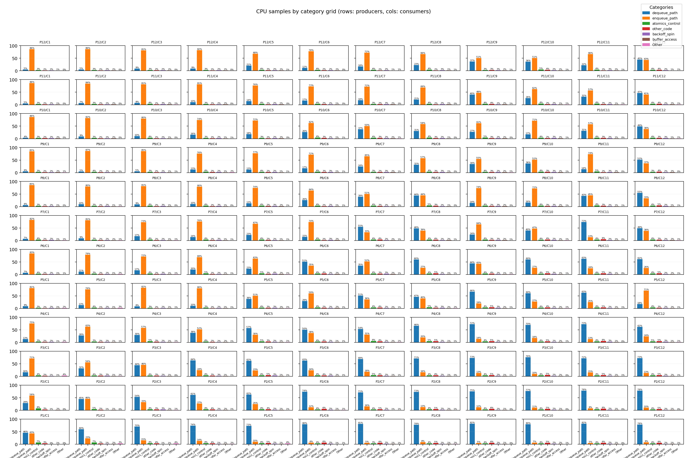

# High-Performance Lock-Free MPMC Queue (C++)

Высокопроизводительная bounded lock-free MPMC очередь на C++ с тестами, бенчмарками и профилированием.

## Цель проекта

Цель проекта — показать, как на практике строится и анализируется lock-free структура данных для многопоточной нагрузки.

Конкретно:
- реализована bounded MPMC очередь на атомарных операциях (без `mutex` в fast path);
- проверяется корректность под конкуренцией (много producers/consumers);
- измеряется масштабирование по `P/C` и `capacity`;
- снимаются профили (`perf`) и визуально анализируются bottleneck'и (CAS contention, cache miss, retry/backoff).

## Возможности проекта

- Lock-free `try_enqueue` / `try_dequeue` без mutex в fast path.
- Корректная синхронизация на атомиках (`acquire/release`, `CAS`).
- Стресс-тесты на корректность при многопоточности.
- Dense-бенчмарки `P/C=1..12` и визуализация метрик.
- Профилирование `perf stat` + `perf record` с автоматической агрегацией результатов.

## Структура

- `include/mpmc_bounded_queue.hpp` — реализация очереди.
- `tests/test_mpmc.cpp` — unit/stress тесты.
- `bench/bench_mpmc.cpp` — микробенчмарк.
- `scripts/run_dense_bench.py` — плотный sweep по producer/consumer.
- `scripts/plot_benchmarks.py` — графики по benchmark CSV.
- `scripts/profile.sh` — профилирование одного запуска.
- `scripts/plot_profiling_runs.py` — сводные графики по множеству профилирований.

## Запуск

### 1) Установить зависимости

Fedora:

```bash
sudo dnf install -y gcc-c++ cmake ninja-build python3 python3-matplotlib perf
```

Ubuntu/Debian:

```bash
sudo apt update
sudo apt install -y g++ cmake ninja-build python3 python3-matplotlib linux-perf
```

### 2) Клонировать репозиторий

```bash
git clone https://github.com/A1ekse4/High-Performance-MPMC
cd High-Performance-MPMC
```

### 3) Сборка

```bash
cmake -S . -B build -G Ninja
cmake --build build -j
```

### 4) Тесты

```bash
ctest --test-dir build --output-on-failure
```

## Benchmark

Одиночный сценарий:

```bash
./build/bench_mpmc <producers> <consumers> <capacity> <seconds>
```

Dense sweep `P/C=1..12` для 3 размеров буфера:

```bash
python3 scripts/run_dense_bench.py \
  --min-producers 1 --max-producers 12 \
  --min-consumers 1 --max-consumers 12 \
  --capacities 4096,32768,262144 \
  --seconds 1 \
  --output build/bench_dense_1_12_caps3.csv
```

Построение benchmark-графиков:

```bash
python3 scripts/plot_benchmarks.py \
  --input build/bench_dense_1_12_caps3.csv \
  --output-dir docs/images
```

## Профилирование (один запуск)

Запуск профилирования одного кейса:

```bash
bash scripts/profile.sh <producers> <consumers> <capacity> <seconds>
```

Пример:

```bash
bash scripts/profile.sh 4 4 32768 1
```

## Профилирование (матрица P/C 1..12)

Прогон всех пар `producer/consumer` для `capacity=32768`:

```bash
for p in $(seq 1 12); do
  for c in $(seq 1 12); do
    PROFILE_SKIP_PLOTS=1 bash scripts/profile.sh "$p" "$c" 32768 1
  done
done
```

Построить итоговую сводку по всем run'ам в `build/profiling/runs/*`:

```bash
python3 scripts/plot_profiling_runs.py \
  --profiling-dir build/profiling \
  --output-dir docs/images
```

## Визуализации (для README/GitHub)

### Benchmark heatmaps



**Подпись и интерпретация:**
- Каждая тепловая карта соответствует фиксированному `capacity`.
- Ось X: число `consumers`, ось Y: число `producers`.
- Цвет и число в ячейке — `effective_ops_per_sec` (пропускная способность).
- Более "горячая" ячейка означает более высокую производительность для конкретной пары `P/C`.
- По этим картам видно, где очередь масштабируется лучше, а где начинается деградация из-за contention.

### Profiling summary grid (P/C)



**Подпись и интерпретация:**
- Это сетка мини-гистограмм в формате heatmap-порядка:  
  `P=1/C=1` внизу слева, `P=12/C=12` вверху справа.
- Каждый сабплот — одна пара `(producer, consumer)`.
- Внутри сабплота 4 метрики:
  - `thr` — throughput в M ops/sec,
  - `ipc` — instructions per cycle,
  - `cache%` — cache miss rate,
  - `branch%` — branch miss rate.
- График показывает не только "насколько быстро", но и "какой ценой по микроархитектуре".

### CPU symbol distribution grid (P/C)



**Подпись и интерпретация:**
- Сетка также организована по парам `P/C` (аналогично предыдущему графику).
- Каждый сабплот показывает распределение CPU samples по категориям горячего кода:
  - `enqueue_path`, `dequeue_path`, `atomics_control`, `backoff_spin`, `buffer_access`, `Other`.
- Подписи на столбцах — доля в процентах для данной категории.
- Если в паре `P/C` растут `backoff_spin` и `atomics_control`, это обычно признак усиления CAS contention.
- Доминирование `enqueue_path` или `dequeue_path` показывает, какая часть fast path становится основным bottleneck.

## Основные артефакты

- `docs/images/throughput_heatmaps.png`
- `docs/images/top_scenarios.png`
- `docs/images/capacity_trends_balanced.png`
- `docs/images/profiling_runs_summary.png`
- `docs/images/profiling_symbol_distribution_pc_grid_subplots.png`
- `docs/images/profiling_runs_summary.csv`
- `docs/images/profiling_symbol_distribution_table.csv`
